# AI Maintainer Toolchain Architecture

Architecture for a toolchain that: (1) annotates the existing codebase with AI-friendly semantic markup, (2) builds a knowledge graph, (3) generates full-stack regression tests, and (4) performs safe refactors to deduplicate and streamline code. The suite is exposed through a local MCP server and can run via CLI, VS Code extension, or a SPA BI client with rich observability and human-in-the-loop workflows.

## Goals and Capabilities
- **Semantic annotation**: AST-aware markup of code, configs, and docs; cross-links to domain concepts; inline provenance for AI agents.
- **Knowledge graph**: Code entities, dependencies, domain concepts, runtime signals, and test artifacts; supports lineage, impact analysis, and context retrieval.
- **Regression generation**: Multi-level packs (unit/component, integration/contract, E2E, golden snapshots, property/fuzz, performance/slo guards) with automatic fixtures, mocks, and environment scaffolding.
- **Refactor & dedup**: Safety-checked rewrites that consolidate near-duplicates, shrink token footprint, extract components/aggregates, and preserve behavior via generated tests.
- **MCP-first surface**: All capabilities available as MCP tools; transport usable by CLI, VS Code extension, and SPA client.
- **Observability & BI UX**: Dashboards for coverage, drift, graph health, refactor risk, and agent actions; review queues for human approval.

## Container View (C4)

```mermaid
C4Container
    title AI Maintainer Toolchain Containers

    Person(dev, "Developer / Reviewer", "Runs CLI, VS Code, or SPA")
    System_Ext(vcs, "Git Provider", "Git/PR events")
    System_Ext(ci, "CI/CD", "Pipelines & artifacts")
    System_Ext(llm, "LLM/Embedding Models", "Hosted or local models")

    System_Boundary(toolchain, "AI Maintainer Toolchain") {
        Container(mcp, "Local MCP Server", "Node.js/TypeScript", "Exposes annotate/graph/test/refactor tools over MCP; streams events")
        Container(orchestrator, "Orchestrator & Job Router", "Node.js/TypeScript", "Schedules pipelines, handles workspaces, applies guardrails and rate limits")
        Container(ast, "Semantic Annotation Engine", "Node.js + tree-sitter/TS AST", "Parses code, emits structured markup, binds symbols to graph nodes")
        Container(kg, "Knowledge Graph Builder", "Python/Node", "Builds/updates graph from AST, runtime traces, docs; maintains lineage")
        Container(tests, "Regression Pack Generator", "Python/Node", "Synthesizes tests at all levels with fixtures, mocks, contracts, and golden outputs")
        Container(refactor, "Refactoring & Dedup Engine", "TypeScript", "Suggests/apply-safe patches; leverages graph + tests for confidence")
        Container(obs, "Observability & BI Service", "Node.js/TypeScript", "Aggregates metrics, renders BI feeds for SPA/extension")

        ContainerDb(graphDb, "Graph Store", "Neo4j/TypeDB", "Code+domain knowledge graph")
        ContainerDb(vectorDb, "Vector Store", "Postgres/pgvector", "Embeddings for semantic search and context windows")
        ContainerDb(artifactStore, "Artifact Store", "S3/local fs", "Test artifacts, diffs, snapshots, reports")
        ContainerDb(cache, "Workspace Cache", "Redis", "Ephemeral cache for ASTs, embeddings, job state")
    }

    Rel(dev, mcp, "Invokes tools via CLI / VS Code / SPA", "MCP (stdio / socket)")
    Rel(dev, obs, "Consumes dashboards", "HTTPS/WebSocket")
    Rel(mcp, orchestrator, "Routes tool calls", "gRPC/IPC")
    Rel(orchestrator, ast, "Dispatches annotation jobs", "Async jobs")
    Rel(orchestrator, kg, "Feeds parsed facts", "Events/queues")
    Rel(orchestrator, tests, "Requests regression packs", "Jobs")
    Rel(orchestrator, refactor, "Requests refactor plans/apply patches", "Jobs")
    Rel(orchestrator, obs, "Emits events/metrics", "Events")

    Rel(ast, kg, "Publishes symbols/relations", "Events")
    Rel(kg, graphDb, "Reads/Writes graph", "Cypher/Gremlin")
    Rel(ast, vectorDb, "Writes embeddings", "SQL")
    Rel(tests, artifactStore, "Stores test assets/reports", "HTTPS")
    Rel(refactor, artifactStore, "Stores diffs/patch sets", "HTTPS")
    Rel(obs, artifactStore, "Reads artifacts for BI views", "HTTPS")
    Rel(orchestrator, cache, "Caches job state", "Redis protocol")

    Rel(orchestrator, vcs, "Reads repo, pushes patches/PRs", "Git/HTTPS")
    Rel(ci, artifactStore, "Publishes CI outputs", "HTTPS")
    Rel(ci, mcp, "Triggers runs via webhook/CLI", "HTTP/MCP")
    Rel(ast, llm, "Optional model calls for labeling", "API")
    Rel(tests, llm, "Generates tests", "API")
    Rel(refactor, llm, "Generates refactor plan/code", "API")
```

## Processing Pipelines
- **Semantic annotation**: (a) file discovery via VCS/CI events; (b) AST parse + symbol table; (c) tagging with docstrings, invariants, contracts, domain glossary; (d) structural markup emitted as sidecar (e.g., `*.sem.json` or inline fenced blocks); (e) embeddings to vector store; (f) facts to knowledge graph.
- **Knowledge graph build/update**: (a) consume AST facts, imports, call graphs, data flows, ownership signals; (b) link docs/specs to code entities; (c) ingest runtime traces/coverage; (d) compute impact and drift scores; (e) expose graph queries via MCP (`graph.query`, `graph.context`).
- **Regression generation**: (a) select targets via graph impact + change diff; (b) derive fixtures/mocks/contracts from interfaces; (c) generate unit/component/integration/E2E/property/golden/perf checks; (d) synthesize data and environments; (e) run locally or hand off to CI; (f) publish results and coverage into observability.
- **Refactor & dedup**: (a) detect clones/near-dupes via embeddings + structure; (b) propose extraction (components/aggregates), dead-code cleanup, token-thinning; (c) generate patch sets with invariants; (d) auto-validate with generated regression packs; (e) stage changes to VCS/PR with rollout plan.

## MCP Surface (Local)
- Tools: `annotate.code`, `annotate.docs`, `graph.build`, `graph.query`, `tests.generate`, `tests.run`, `refactor.plan`, `refactor.apply`, `observability.stream`.
- Transport: stdio or unix/named socket for local-first; supports streaming tokens/events.
- Contracts: all tools return artifacts (paths), metrics, and graph node references to maintain provenance.
- Guardrails: rate limiting, workspace allowlist, dry-run and apply modes, SARIF-style findings for safety.

## Clients and UX
- **CLI**: Thin wrapper over MCP; commands like `ai-maint annotate --scope src/`, `ai-maint graph query --impact FooService`, `ai-maint tests generate --target carts`, `ai-maint refactor apply --plan plan.json`.
- **VS Code extension**: Surfaces gutter actions (annotate/generate tests/refactor), diff reviewers, and human-in-loop approval queues; streams MCP events; embeds BI widgets (coverage drift, graph hotspots).
- **SPA BI client**: Lightweight React app consuming Observability service; dashboards for graph health, test coverage, refactor risk, duplicate heatmaps, agent activity timelines; supports review/approval and replay of MCP actions.

## Data & Artifacts
- **Markup**: Sidecar semantic JSON/YAML; optional inline fenced blocks tagged per language comment style.
- **Graph**: Nodes (file, class, function, variable, spec, test, run, dataset) and edges (calls, imports, owns, verifies, satisfies, references); includes lineage/time/version stamps.
- **Tests**: Generated code, fixtures, cassettes, snapshot baselines, property seeds, perf thresholds; results emitted as JUnit/JSON plus BI metrics.
- **Refactor outputs**: Patch sets, safety reports (blast radius, coverage deltas), and rollback hooks.

## Observability, Governance, and Safety
- Metrics: coverage (test/annotation), graph completeness, duplicate density, token footprint, refactor risk, success/failure rates, latency.
- Tracing: per-tool spans with workspace + commit hash tags; event stream consumable by SPA and extension.
- Policies: workspace allowlists, PII scrubbing in embeddings, rate limits, audit logs for agent actions; dry-run defaults for write operations.
- Human-in-loop: approval gates for refactors and test application; review queues; explainability via graph-backed context panes.

## Deployment Modes
- **Local dev**: MCP server runs with stdio transport; CLI and VS Code extension connect directly; SPA served locally.
- **CI mode**: Headless CLI triggers pipelines; artifacts pushed to stores; MCP can run as sidecar for job orchestration.
- **Hybrid**: SPA/extension connect to a long-running MCP daemon with cached graph/vector stores for faster incremental runs.
