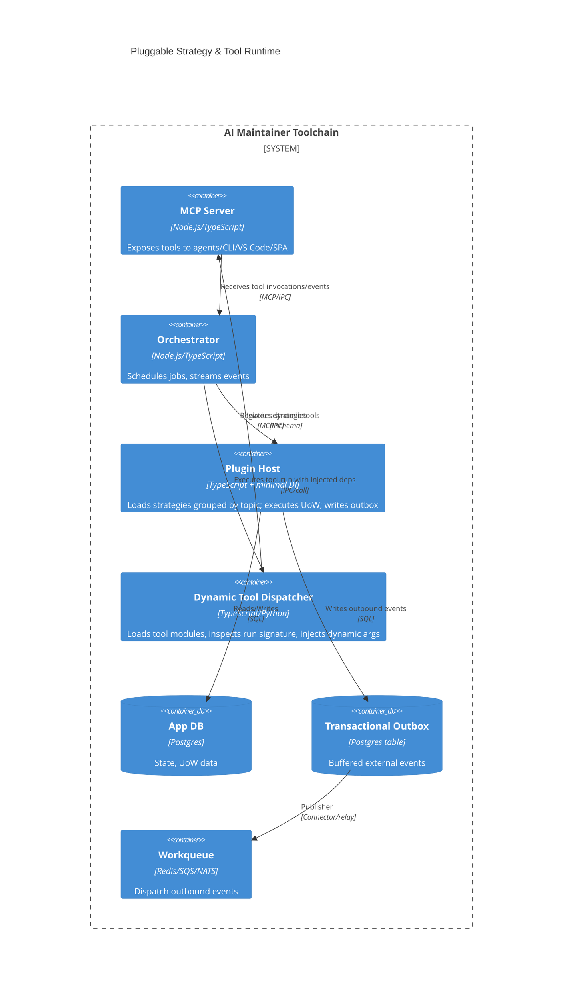

# AI Maintainer Pluggable Architecture (DI + MCP)

Plug-in architecture for the AI Maintainer toolchain: strategies are registered into a DI container (grouped by topic), carry lifecycle metadata (topics, DTO, UoW), rely on transactional outbox for external effects, and are exposed to AI agents via MCP and a dynamic tool dispatcher.

## Principles
- **Group-based DI**: Strategies register into a shared group; the dispatcher injects `Strategy[]` from the DI container.
- **Self-contained lifecycle**: Each strategy declares input topic, DTO contract, UoW handler, and outbox events. No hidden global state.
- **Transactional outbox**: External side effects are modeled as outbox events; strategies only touch DB + enqueue work.
- **Pluggable discovery**: New strategies/tools are discovered by scanning plugin folders; no core changes.
- **Contract-first**: DTO/models declared alongside strategy; architect gets interfaces + sample strategy for codegen.
- **Human-in-loop ready**: Generated strategies and tool schemas go through BI/UX review queues before activation.

## Component View (C4)


## Strategy Contract (TypeScript + minimal DI)
- Interface shape:
  ```ts
  export interface Strategy {
    name(): string;
    topic(): string; // inbound topic to consume
    handle(message: unknown, deps: Deps): Promise<void> | void;
  }

  export type Deps = {
    logger: Logger;
    // optional: db, outbox, metrics, adapters
  };
  ```
- Registration example:
  ```ts
  const registry = new StrategyRegistry();
  registry.register(new AnnotateStrategy());
  registry.register(new GraphIngestStrategy());

  const dispatcher = new Dispatcher(registry, { logger, /* deps */ });
  await dispatcher.dispatch("annotate.topic", payload);
  ```
- For lifecycle/start/stop and grouped wiring, use the minimal DI container (`src/plugin-host/di.ts`) to register strategies and resources as providers.

## Tool Plugin Contract (Dynamic run, MCP-exposed)
- Each tool module exports `TOOL_SCHEMA` (JSON schema) and `run(**kwargs)`.
- Dispatcher logic:
  ```python
  def execute(tool_func, tool_args, injected):
      all_args = {**injected, **tool_args}
      sig = inspect.signature(tool_func)
      filtered = {k: v for k, v in all_args.items() if k in sig.parameters}
      return tool_func(**filtered)
  ```
- Injected defaults: `db_manager`, `tool_executor`, `workspace`, `logger`, `outbox_writer`, etc.
- Tool registration: scan `plugins/` or `tools/` for `*_tool.py`, load `TOOL_SCHEMA`, register with MCP server; no core edits.

## Execution Flow
1) **Registration**: Plugin host boots, loads strategy providers (via registry or DI module), grouped by topic.
2) **Message handling**: Dispatcher listens on topics/IPC, finds matching strategy, decodes DTO, calls `handle`.
3) **UoW + outbox**: Handler performs DB work in transaction, writes outbound events to outbox table.
4) **Relay**: Outbox relayer publishes events to `queue`; downstream connectors deliver to external systems.
5) **MCP tools**: Tools are served by MCP; orchestrator/CLI/VS Code/SPA invoke them; dispatcher injects available deps.
6) **Observability**: All steps emit spans/metrics to Observability service and BI dashboards.

## Inspector / Auditor Mode
- **Purpose**: Monitor guardrails/policies (DTO validation, idempotency, rate limits, PII scrubbing, outbox integrity), detect unsafe plans, and whistleblow obvious correctness issues.
- **Placement**: Runs as a sidecar in orchestrator + plugin host; subscribes to spans/events/metrics and inspects MCP tool calls.
- **Checks**:
  - Missing validation or DTO mismatch for a strategy.
  - Outbox writes without paired commit; orphaned events; relay lag.
  - Excessive retries, circuit trips, or rate-limit breaches.
  - Token bloat in generated patches/tests; duplicate code without dedup plan.
  - Unreviewed tool/strategy activation (bypassing approval queue).
  - PII/secret leakage in embeddings/logs.
- **Alerting (unobtrusive but effective)**:
  - For implementor agent: return structured MCP warnings with severity + remediation hint; throttle repeats; block only on critical (e.g., missing validation or outbox off).
  - For humans: non-modal toasts in SPA/VS Code with "Inspect" deep link; BI panel "Auditor Warnings" with filters; daily digest in CLI (`ai-maint inspector report`).
  - Escalation: if the same issue repeats N times or is critical, open a review task in the approval queue instead of spamming.
- **APIs**:
  - `inspector.stream` (MCP): subscribe to live findings with scopes (strategy/tool/commit).
  - `inspector.snapshot` (MCP): fetch current outstanding findings grouped by severity.
  - `inspector.waive` (MCP): record a waiver with scope + expiry + rationale (logged).
- **Integration points**:
  - DI hooks wrap strategy dispatch to record validation/exceptions and emit events to inspector.
  - Tool dispatcher wraps `run` to log schema adherence and argument filtering.
  - Observability service forwards spans/metrics to inspector rules engine.
- **Signal hygiene**: deduplicate similar warnings, cap rate, include suppression/waiver metadata, and carry provenance (strategy/tool, commit, workspace, actor).

## Developer Workflow (Kilocode/Architect)
- Provide: service interfaces, sample strategy, DTO models, and algorithm description to the architect agent.
- Architect outputs: new strategy file (TS class + registration + tests) or new tool module with `TOOL_SCHEMA` + `run`.
- Human review: BI/UX surfaces plan + diff; approval before activation.
- Deployment: Drop new strategy/tool file into plugin folder; restart/hot-reload plugin host or tool dispatcher; MCP surface updates automatically.

## Safety & Guardrails
- DTO validation on ingest; type-checked decode.
- Idempotency keys per message; retry with backoff.
- Outbox relayer with exactly-once semantics per event id.
- Rate limits per strategy/topic; circuit breakers on downstream connectors.
- Audit log of tool/strategy executions; MCP actions trace to user/agent/session; inspector warnings visible to agents and humans.
