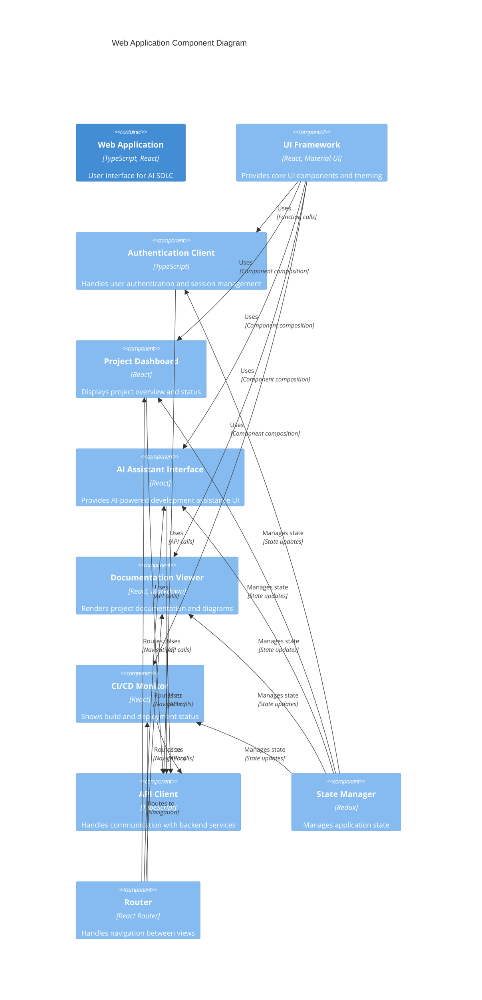
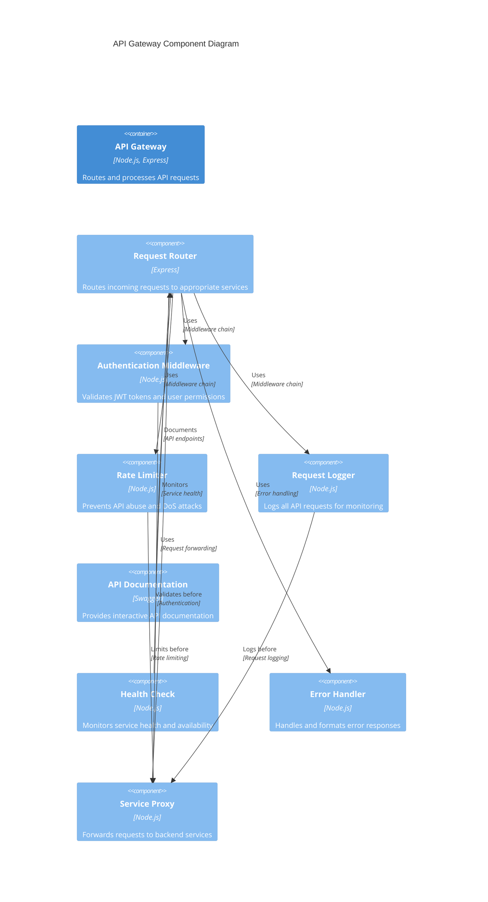
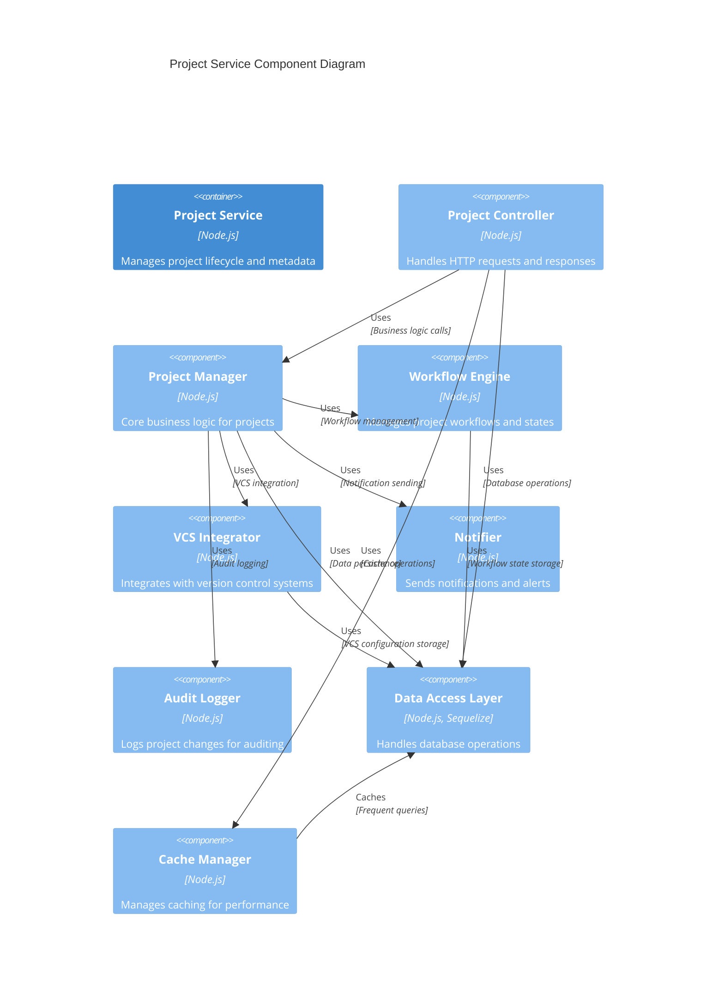

# C4 Component Diagrams

This document contains component-level diagrams for the major services in the AI SDLC system.

## Web Application Components



## API Gateway Components



## Project Service Components



## AI Service Components

```mermaid
C4Component
    title AI Service Component Diagram
    
    Container(aiService, "AI Service", "Python, TensorFlow", "Provides AI-powered development assistance")
    
    Component(apiInterface, "API Interface", "Python, Flask", "Handles HTTP requests and responses")
    Component(codeAnalyzer, "Code Analyzer", "Python", "Analyzes code quality and structure")
    Component(codeGenerator, "Code Generator", "Python, LLMs", "Generates code based on requirements")
    Component(testGenerator, "Test Generator", "Python", "Generates unit and integration tests")
    Component(docGenerator, "Documentation Generator", "Python", "Generates project documentation")
    Component(architectureAdvisor, "Architecture Advisor", "Python", "Provides architecture recommendations")
    Component(modelManager, "Model Manager", "Python, TensorFlow", "Manages AI models and training")
    Component(promptEngine, "Prompt Engine", "Python", "Handles prompt engineering for LLMs")
    Component(contextManager, "Context Manager", "Python", "Manages project context for AI")
    
    Rel(apiInterface, codeAnalyzer, "Uses", "Code analysis requests")
    Rel(apiInterface, codeGenerator, "Uses", "Code generation requests")
    Rel(apiInterface, testGenerator, "Uses", "Test generation requests")
    Rel(apiInterface, docGenerator, "Uses", "Documentation generation requests")
    Rel(apiInterface, architectureAdvisor, "Uses", "Architecture advice requests")
    
    Rel(codeAnalyzer, contextManager, "Uses", "Project context")
    Rel(codeGenerator, contextManager, "Uses", "Project context")
    Rel(codeGenerator, promptEngine, "Uses", "Prompt engineering")
    Rel(testGenerator, contextManager, "Uses", "Project context")
    Rel(docGenerator, contextManager, "Uses", "Project context")
    Rel(architectureAdvisor, contextManager, "Uses", "Project context")
    
    Rel(modelManager, codeGenerator, "Provides models", "Model loading")
    Rel(modelManager, testGenerator, "Provides models", "Model loading")
    Rel(modelManager, docGenerator, "Provides models", "Model loading")
    Rel(modelManager, architectureAdvisor, "Provides models", "Model loading")