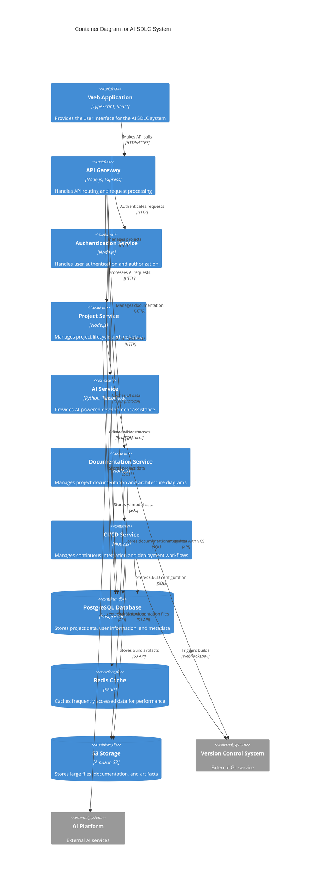

# C4 Container Diagram

This diagram shows the high-level containers (applications, data stores, etc.) that make up the AI SDLC system.

## Container Descriptions

### Web Application
- **Technology**: TypeScript, React
- **Responsibility**: Provides the user interface for developers, project managers, and stakeholders
- **Communication**: Makes API calls to the API Gateway via HTTP/HTTPS

### API Gateway
- **Technology**: Node.js, Express
- **Responsibility**: Routes requests to appropriate services and handles API management
- **Communication**: Routes requests to all internal services via HTTP

### Authentication Service
- **Technology**: Node.js
- **Responsibility**: Handles user authentication, authorization, and session management
- **Data Storage**: PostgreSQL for user data

### Project Service
- **Technology**: Node.js
- **Responsibility**: Manages project lifecycle, metadata, and workflows
- **Data Storage**: PostgreSQL for project data
- **External Integration**: Version Control System

### AI Service
- **Technology**: Python, TensorFlow
- **Responsibility**: Provides AI-powered development assistance, code generation, and automation
- **Data Storage**: PostgreSQL for AI model data
- **External Integration**: External AI Platform services

### Documentation Service
- **Technology**: Node.js
- **Responsibility**: Manages project documentation, architecture diagrams, and knowledge base
- **Data Storage**: PostgreSQL for metadata, S3 for file storage

### CI/CD Service
- **Technology**: Node.js
- **Responsibility**: Manages continuous integration, delivery, and deployment workflows
- **Data Storage**: PostgreSQL for configuration, S3 for artifacts
- **External Integration**: Version Control System for build triggers