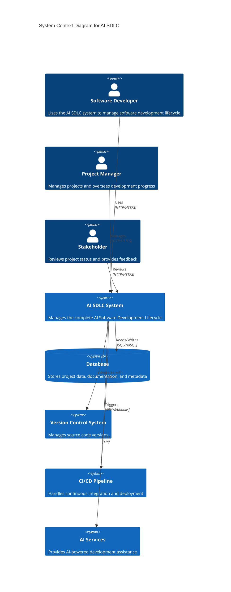

# C4 Context Diagram

This diagram shows the high-level context of the AI SDLC system and its interactions with external entities.

## Key Components

- **Software Developer**: Primary user who interacts with the system for development tasks
- **Project Manager**: Manages projects and monitors progress
- **Stakeholder**: Reviews project status and provides business feedback
- **AI SDLC System**: Core system managing the AI software development lifecycle
- **Database**: Stores all project-related data and metadata
- **Version Control System**: Manages source code and version history
- **CI/CD Pipeline**: Handles automated testing and deployment
- **AI Services**: Provides AI-powered development assistance and automation